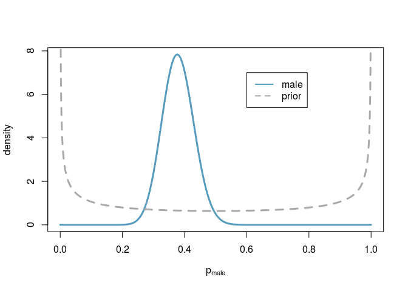
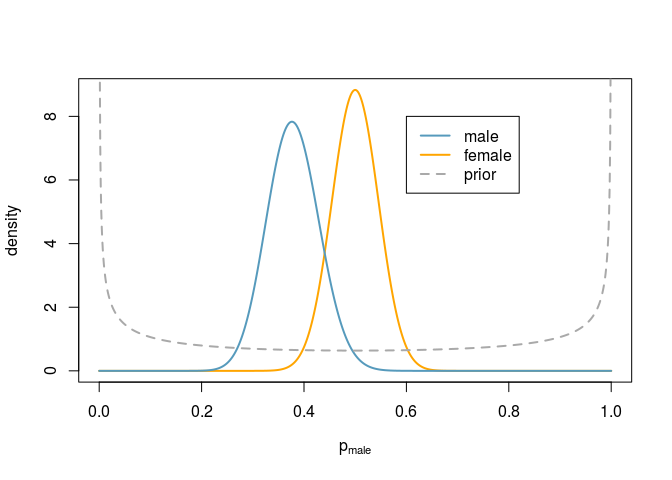
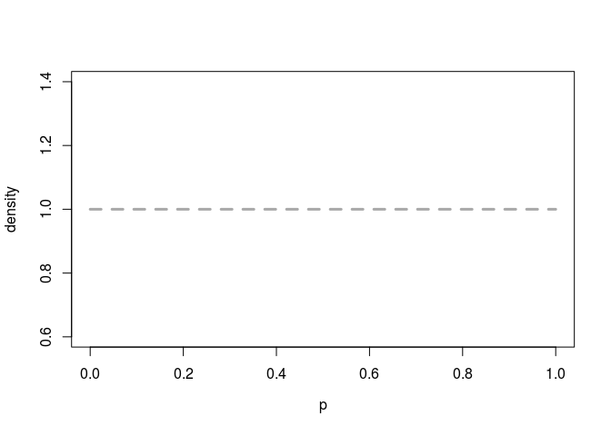
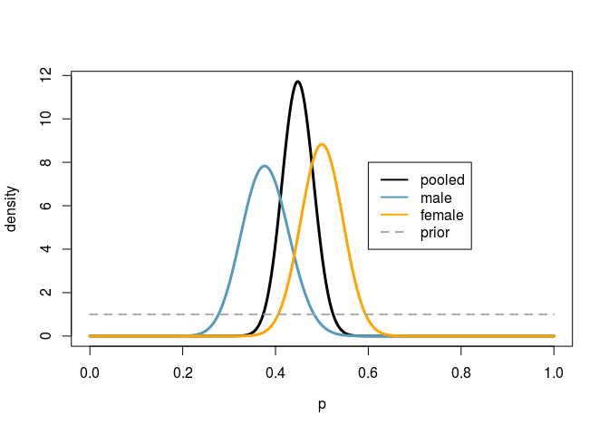

Comparing two proportions using Bayes factors: assumptions
================
Dr. Merlise Clyde, Duke University

create the data based on summary counts
---------------------------------------

``` r
USASurvey = matrix(c(34,61,52,61, 4,0), ncol=2,byrow=T)
colnames(USASurvey) = c("Male", "Female")
rownames(USASurvey) = c("Yes", "No", "Not Sure")
USASurvey
```

    ##          Male Female
    ## Yes        34     61
    ## No         52     61
    ## Not Sure    4      0

### compute the sample sizes in each group

``` r
n = apply(USASurvey, 2, sum)
```

Note: we are combining "No" and "Not Sure" into the "Not Yes" group, so for analyses we need just the total counts in each group `n` and the number of "Yes" counts or the first row `USASurvey[1,]`.

Prior and Posterior Beta Distributions
--------------------------------------

### Beta prior and posterior distribution for males under HA

``` r
myblue = rgb(86,155,189, name="myblue", max=256)

aA.M = c(.5, .5)   # default beta hyperparameters for Males
x = seq(0, 1, length=1000)
plot(x, dbeta(x, USASurvey[1,"Male"] + aA.M[1], 
              n[1] - USASurvey[1,"Male"] + aA.M[2]),
     type="l", col=myblue, lwd=3, 
     xlab=expression(p[male]), ylab="density")
# add lines for prior for males
lines(x, dbeta(x, aA.M[1], aA.M[2]), lty=2, col="darkgrey", lwd=3)
# add legend
legend(.6, 7 ,  legend=c("male", "prior"),
       col=c(myblue, "darkgrey"), lwd=rep(2,2),  lty=c(1,2))
```



### Beta prior and posterior distribution for females under HA

``` r
aA.F = c(.5, .5)   # default beta hyperparameters for Females

plot(x, dbeta(x, USASurvey[1,"Female"] + aA.F[1],  
              n[2] - USASurvey[1,"Female"] + aA.F[2]),
     type="l", col="orange", lwd=2, 
     xlab=expression(p[male]), ylab="density", cex=1.5)
lines(x, dbeta(x, USASurvey[1,"Male"] + aA.M[1], 
               n[1] - USASurvey[1,"Male"] + aA.M[2]),
      type="l", col=myblue, lwd=2)
lines(x, dbeta(x, aA.F[1], aA.F[2]), lty=2, col="darkgrey", lwd=2)
legend(.6, 8, legend=c("male", "female", "prior"),
       col=c(myblue, "orange", "darkgrey"), lwd=rep(2,3),  lty=c(1,1,2))
```



Pooled analysis under H0
------------------------

### pooled prior

we obtain the hyperparameters of the beta prior distribution under HO by adding the hyperparemters of the two groups

``` r
aO = aA.M + aA.F   # Combined Prior
plot(x, dbeta(x, aO[1], aO[2]), 
     xlab=expression(p), ylab="density",
     type="l", col="darkgrey", lwd=3, lty=2)
```



### pooled prior and posterior distribution under H0 and overlay of posteriors under HA

``` r
plot(x, dbeta(x, USASurvey[1,"Male"]+ USASurvey[1,"Female"] + aO[1], 
              n[1]+n[2]-(USASurvey[1,"Male"]+USASurvey[1,"Female"]) + aO[2]), 
     type="l", col="black", lwd=3, 
     xlab=expression(p), ylab="density")
# add posterior for male under HA
lines(x, dbeta(x, USASurvey[1,"Male"] + aA.M[1], 
               n[1]-USASurvey[1,"Male"] + aA.M[2]), type="l", col=myblue,
     lwd=3)
# add posterior for female under HA
lines(x, dbeta(x, USASurvey[1,"Female"] + aA.F[1],  
               n[2] - USASurvey[1,"Female"] + aA.F[2]), 
      col="orange", lwd=3)
# add pooled prior
lines(x, dbeta(x, aA.M[1]+aA.F[2], aA.M[2]+aA.F[2]), lty=2, col="darkgrey", lwd=2)
# legend
legend(.6, 8, legend=c("pooled","male", "female", "prior"), 
       col=c("black", myblue, "orange", "darkgrey"),
       lwd=rep(2,4),  lty=c(rep(1,3),2)
        )
```


