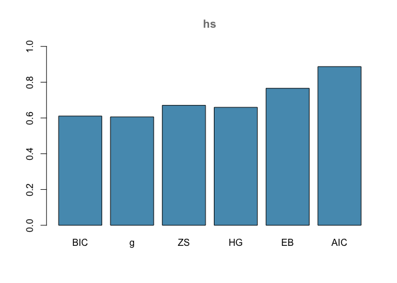
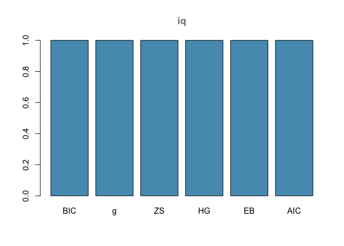
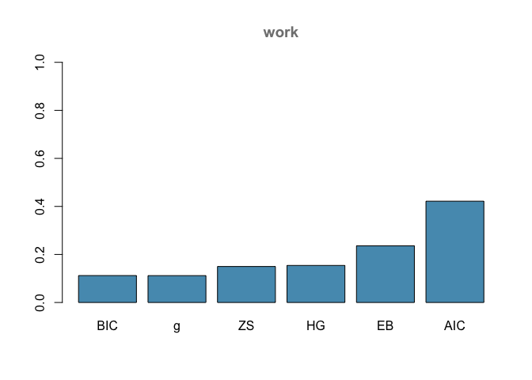
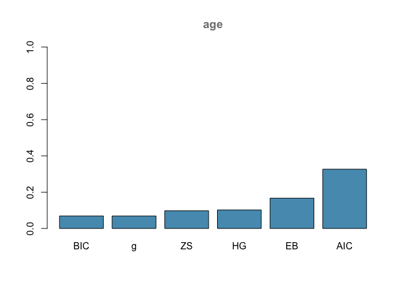

Priors for Bayesian Model Uncertainty
================

Read in data and pre-process

``` r
library(foreign)
cognitive = read.dta("http://www.stat.columbia.edu/~gelman/arm/examples/child.iq/kidiq.dta")
cognitive$mom_work = as.numeric(cognitive$mom_work > 1)
cognitive$mom_hs =  as.numeric(cognitive$mom_hs > 0)
colnames(cognitive) = c("kid_score", "hs","iq", "work", "age") 
n = nrow(cognitive)
```

Run BAS using different prior distributions

``` r
library(BAS)
cog.g = bas.lm(kid_score ~ ., data=cognitive, prior="g-prior", 
               a=n, modelprior=uniform())
# a is the hyperparameter in this case g=a
cog.ZS = bas.lm(kid_score ~ ., data=cognitive, prior="ZS-null", 
                a=n, modelprior=uniform())
cog.BIC = bas.lm(kid_score ~ ., data=cognitive, prior="BIC", 
                 a=n, modelprior=uniform())
cog.AIC = bas.lm(kid_score ~ ., data=cognitive, prior="AIC", 
                 modelprior=uniform())
cog.HG = bas.lm(kid_score ~ ., data=cognitive, prior="hyper-g-n", 
                a=3, modelprior=uniform()) 
# hyperparameter a=3
cog.EB = bas.lm(kid_score ~ ., data=cognitive, prior="EB-local", 
                a=n, modelprior=uniform())

probne0 = cbind(cog.BIC$probne0, cog.g$probne0,cog.ZS$probne0,  
                cog.HG$probne0, cog.EB$probne0,  cog.AIC$probne0)
colnames(probne0) = c("BIC","g", "ZS", "HG", "EB", "AIC")
rownames(probne0) = c(cog.BIC$namesx)
```

The matrix `probne0` contains all of the marginal inclusion probabilities for each method.

``` r
probne0
```

    ##                  BIC         g         ZS        HG        EB       AIC
    ## Intercept 1.00000000 1.0000000 1.00000000 1.0000000 1.0000000 1.0000000
    ## hs        0.61063772 0.6061972 0.67061182 0.6594835 0.7658089 0.8872005
    ## iq        1.00000000 1.0000000 1.00000000 1.0000000 1.0000000 1.0000000
    ## work      0.11210135 0.1118270 0.14981338 0.1542473 0.2358418 0.4217659
    ## age       0.06897758 0.0688912 0.09760242 0.1021047 0.1671187 0.3268069

Let's plot them

``` r
myblue = rgb(86,155,189, name="myblue", max=256)
mydarkgrey = rgb(.5,.5,.5, name="mydarkgrey", max=1)

for (i in 2:5) {
  barplot(height=probne0[i,], ylim=c(0,1), main=cog.g$namesx[i],
          col.main=mydarkgrey, col=myblue)
}
```


