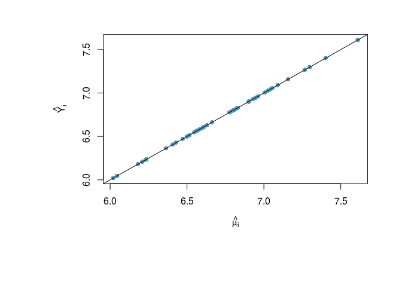

decision making under uncertainty
================

Load the data and preprocess

``` r
library(MASS)
data(UScrime)

#Log transform all continuous variables except `So` which is in column 2. 
# We're overwriting the dataframe in this case.

UScrime[,-2] = log(UScrime[,-2])
```

### Run BAS

I am going to run `BAS` using the sampling without replacement option to enumerate all 2<sup>15</sup> models.

``` r
library(BAS)
crime.ZS =  bas.lm(y ~ ., 
                   data=UScrime,
                   prior="ZS-null",
                   modelprior=uniform()) 
```

**Model Choice**

`BAS` has methods defined to return fitted values, `fitted`, using the observed design matrix and predictions at either the observed data or potentially new values, `predict`, as with `lm`.

``` r
muhat.BMA = fitted(crime.ZS, estimator="BMA")
BMA  = predict(crime.ZS, estimator="BMA")

# predict has additional slots for fitted values under BMA, predictions under each model
names(BMA)
```

    ##  [1] "fit"         "Ybma"        "Ypred"       "postprobs"   "se.fit"     
    ##  [6] "se.pred"     "se.bma.fit"  "se.bma.pred" "df"          "best"       
    ## [11] "bestmodel"   "prediction"  "estimator"

Plotting the two sets of fitted values,

``` r
par(mar=c(9, 9, 3, 3))
plot(muhat.BMA, BMA$fit, 
     pch=16, col=myblue,
     xlab=expression(hat(mu[i])), ylab=expression(hat(Y[i])))
abline(0,1)
```

 we see that they are in perfect agreement. That is always the case as the posterior mean for the regression mean function at a point *x* is the expected posterior predictive value for *Y* at *x*. This is true not only for estimators such as BMA, but the expected values under model selection.

### Inference with model selection

In addition to using BMA, we can use the posterior means under model selection. This corresponds to a decision rule that combines estimation and selection. `BAS` currently implements the following options

**highest probability model:**

``` r
HPM = predict(crime.ZS, estimator="HPM")

# show the indices of variables in the best model where 0 is the intercept
HPM$bestmodel
```

    ## [1]  0  1  3  4  9 11 13 14 15

A little more interpretable version with names:

``` r
(crime.ZS$namesx[HPM$bestmodel +1])[-1]
```

    ## [1] "M"    "Ed"   "Po1"  "NW"   "U2"   "Ineq" "Prob" "Time"

This model is stored in the output in position 27026 and can be extracted as

``` r
HPM$best
```

    ## [1] 27026

If we wanted to find the coefficients for this model for example, we could use the following:

``` r
crime.coef.ZS = coef(crime.ZS)
crime.coef.ZS$conditionalmeans[HPM$best,]
```

    ##   Intercept           M          So          Ed         Po1         Po2 
    ##  6.72493620  0.00000000  0.00000000  0.53397171  1.10824258  0.00000000 
    ##          LF         M.F         Pop          NW          U1          U2 
    ##  0.00000000  0.00000000 -0.01553586  0.00000000  0.00000000  0.00000000 
    ##         GDP        Ineq        Prob        Time 
    ## -1.06422941  0.00000000 -0.10163107  0.06721722

``` r
crime.coef.ZS$conditionalsd[HPM$best,]
```

    ##  Intercept          M         So         Ed        Po1        Po2 
    ## 0.04425181 0.00000000 0.00000000 0.68050686 0.25035300 0.00000000 
    ##         LF        M.F        Pop         NW         U1         U2 
    ## 0.00000000 0.00000000 0.05902282 0.00000000 0.00000000 0.00000000 
    ##        GDP       Ineq       Prob       Time 
    ## 0.50271545 0.00000000 0.13789271 0.25715072

to extract the posterior means and posterior standard deviations of the coefficients of the highest probability model.

**median probability model:**

``` r
MPM = predict(crime.ZS, estimator="MPM")
attr(MPM$fit, 'model')
```

    ## [1]  0  1  3  4  9 11 13 14

``` r
(crime.ZS$namesx[attr(MPM$fit, 'model') +1])[-1]
```

    ## [1] "M"    "Ed"   "Po1"  "NW"   "U2"   "Ineq" "Prob"

Note that we can also extract the best model from the attribute in the fitted values as well.

For obtaining fitted or predicted values, the media probability model may not be part of the sample (in the general case without enumeration) so the fitted and predict code in BAS actually just refits this model initializing BAS at this model. Here is actually what is under the hood in case you wanted to find coefficients for the MPM.

``` r
crime.MPM = bas.lm(y ~ ., 
                   data=UScrime,
                   prior="ZS-null",
                   modelprior=uniform(),
                   bestmodel=crime.ZS$probne0 > .5, n.models=1) 
```

The logical condition `crime.ZS$probne0` provides a vector of length 16 of the inclusion indicators of the median probabilty model, e.g. where the probabilty that the coefficient is not 0 is greater than 0.5. The option `n.models = 1` fits just this model.

Using the `coef` function applied to just this model we can extract the coefficients for the HPM model:

``` r
coef(crime.MPM)
```

    ## 
    ##  Marginal Posterior Summaries of Coefficients: 
    ## 
    ##  Using  BMA 
    ## 
    ##  Based on the top  1 models 
    ##            post mean  post SD   post p(B != 0)
    ## Intercept   6.72494    0.02713   1.00000      
    ## M           1.46180    0.43727   1.00000      
    ## So          0.00000    0.00000   0.00000      
    ## Ed          2.30642    0.43727   1.00000      
    ## Po1         0.87886    0.16204   1.00000      
    ## Po2         0.00000    0.00000   0.00000      
    ## LF          0.00000    0.00000   0.00000      
    ## M.F         0.00000    0.00000   0.00000      
    ## Pop         0.00000    0.00000   0.00000      
    ## NW          0.08162    0.03743   1.00000      
    ## U1          0.00000    0.00000   0.00000      
    ## U2          0.31053    0.12816   1.00000      
    ## GDP         0.00000    0.00000   0.00000      
    ## Ineq        1.18815    0.28710   1.00000      
    ## Prob       -0.18401    0.06466   1.00000      
    ## Time        0.00000    0.00000   0.00000

**best predictive model:**

This is the model that is closest to BMA predictions under squared error loss.

``` r
BPM = predict(crime.ZS, estimator="BPM")
(crime.ZS$namesx[attr(BPM$fit, 'model') +1])[-1]
```

    ##  [1] "M"    "So"   "Ed"   "Po1"  "Po2"  "M.F"  "NW"   "U2"   "Ineq" "Prob"

Let's see how they compare:

``` r
myblue = rgb(86,155,189, name="myblue", max=256)
mydarkgrey = rgb(.5,.5,.5, name="mydarkgrey", max=1)
par(cex=1.8, cex.axis=1.8, cex.lab=2, mfrow=c(2,2), mar=c(5, 5, 3, 3), col.lab=mydarkgrey, col.axis=mydarkgrey, col=mydarkgrey)
library(GGally)
ggpairs(data.frame(HPM = as.vector(HPM$fit),  #this used predict so we need to extract fitted values
                   MPM = as.vector(MPM$fit),  # this used fitted
                   BPM = as.vector(BPM$fit),  # this used fitted
                   BMA = as.vector(BMA$fit))) # this used predict
```


Using the `se.fit = TRUE` option with `predict` we can also calculate standard deviations for prediction or for the mean and use this as imput for the `confint` function for the prediction object.

``` r
BPM = predict(crime.ZS, estimator="BPM", se.fit=TRUE)
crime.conf.fit = confint(BPM, parm="mean")
crime.conf.pred = confint(BPM, parm="pred")
cbind(BPM$fit, crime.conf.fit, crime.conf.pred)
```

    ##                  2.5  %  97.5  %     mean   2.5  %  97.5  %     pred
    ##  [1,] 6.668988 6.513238 6.824738 6.668988 6.258715 7.079261 6.668988
    ##  [2,] 7.290854 7.151787 7.429921 7.290854 6.886619 7.695089 7.290854
    ##  [3,] 6.202166 6.039978 6.364354 6.202166 5.789406 6.614926 6.202166
    ##  [4,] 7.661307 7.490608 7.832006 7.661307 7.245129 8.077484 7.661307
    ##  [5,] 7.015570 6.847647 7.183493 7.015570 6.600523 7.430617 7.015570
    ##  [6,] 6.469547 6.279276 6.659818 6.469547 6.044966 6.894128 6.469547
    ##  [7,] 6.776133 6.555130 6.997135 6.776133 6.336920 7.215346 6.776133
    ##  [8,] 7.299560 7.117166 7.481955 7.299560 6.878450 7.720670 7.299560
    ##  [9,] 6.614927 6.482384 6.747470 6.614927 6.212890 7.016964 6.614927
    ## [10,] 6.596912 6.468988 6.724836 6.596912 6.196374 6.997449 6.596912
    ## [11,] 7.032834 6.877582 7.188087 7.032834 6.622750 7.442918 7.032834
    ## [12,] 6.581822 6.462326 6.701317 6.581822 6.183896 6.979748 6.581822
    ## [13,] 6.467921 6.281998 6.653843 6.467921 6.045271 6.890571 6.467921
    ## [14,] 6.566239 6.403813 6.728664 6.566239 6.153385 6.979092 6.566239
    ## [15,] 6.550129 6.388987 6.711270 6.550129 6.137779 6.962479 6.550129
    ## [16,] 6.888592 6.746097 7.031087 6.888592 6.483166 7.294019 6.888592
    ## [17,] 6.252735 6.063944 6.441526 6.252735 5.828815 6.676654 6.252735
    ## [18,] 6.795764 6.564634 7.026895 6.795764 6.351369 7.240160 6.795764
    ## [19,] 6.945687 6.766289 7.125086 6.945687 6.525866 7.365508 6.945687
    ## [20,] 7.000331 6.840374 7.160289 7.000331 6.588442 7.412220 7.000331
    ## [21,] 6.613748 6.443389 6.784108 6.613748 6.197710 7.029787 6.613748
    ## [22,] 6.509534 6.352123 6.666946 6.509534 6.098628 6.920441 6.509534
    ## [23,] 6.781430 6.589687 6.973172 6.781430 6.356187 7.206672 6.781430
    ## [24,] 6.801865 6.659905 6.943825 6.801865 6.396626 7.207104 6.801865
    ## [25,] 6.368493 6.187973 6.549014 6.368493 5.948191 6.788795 6.368493
    ## [26,] 7.406220 7.173560 7.638879 7.406220 6.961027 7.851412 7.406220
    ## [27,] 5.995056 5.780243 6.209869 5.995056 5.558924 6.431187 5.995056
    ## [28,] 7.130996 6.970370 7.291621 7.130996 6.718847 7.543144 7.130996
    ## [29,] 7.084303 6.904331 7.264275 7.084303 6.664237 7.504370 7.084303
    ## [30,] 6.519208 6.360876 6.677539 6.519208 6.107948 6.930468 6.519208
    ## [31,] 6.191546 5.952977 6.430114 6.191546 5.743237 6.639854 6.191546
    ## [32,] 6.646586 6.472328 6.820844 6.646586 6.228936 7.064236 6.646586
    ## [33,] 6.778853 6.591383 6.966323 6.778853 6.355520 7.202186 6.778853
    ## [34,] 6.813627 6.683297 6.943958 6.813627 6.412314 7.214940 6.813627
    ## [35,] 6.686652 6.503099 6.870205 6.686652 6.265039 7.108265 6.686652
    ## [36,] 7.046639 6.788852 7.304426 7.046639 6.587815 7.505464 7.046639
    ## [37,] 6.786861 6.601977 6.971745 6.786861 6.364667 7.209055 6.786861
    ## [38,] 6.306094 6.128026 6.484162 6.306094 5.886840 6.725348 6.306094
    ## [39,] 6.600676 6.460387 6.740965 6.600676 6.196020 7.005333 6.600676
    ## [40,] 7.094493 6.934796 7.254189 7.094493 6.682705 7.506280 7.094493
    ## [41,] 6.595673 6.374613 6.816734 6.595673 6.156431 7.034916 6.595673
    ## [42,] 6.005732 5.761671 6.249794 6.005732 5.554476 6.456988 6.005732
    ## [43,] 6.962800 6.822918 7.102682 6.962800 6.558285 7.367316 6.962800
    ## [44,] 7.065421 6.910261 7.220580 7.065421 6.655371 7.475470 7.065421
    ## [45,] 6.266709 6.060228 6.473190 6.266709 5.834621 6.698797 6.266709
    ## [46,] 6.511698 6.315350 6.708046 6.511698 6.084359 6.939037 6.511698
    ## [47,] 6.823072 6.644370 7.001773 6.823072 6.403548 7.242596 6.823072

Finding the coefficients of the BPM is similar to the HPM:

``` r
# location of BPM;

BPM$best
```

    ## [1] 4882

``` r
crime.coef.ZS$conditionalmeans[BPM$best,]
```

    ##    Intercept            M           So           Ed          Po1 
    ##  6.724936198  1.060026398  0.000000000  1.634993243  0.000000000 
    ##          Po2           LF          M.F          Pop           NW 
    ##  0.000000000  0.000000000  0.000000000  0.001758298  0.209683093 
    ##           U1           U2          GDP         Ineq         Prob 
    ##  0.000000000  0.000000000  1.244587787  1.085147406 -0.419437308 
    ##         Time 
    ## -0.440884097

``` r
crime.coef.ZS$conditionalsd[BPM$best,]
```

    ##  Intercept          M         So         Ed        Po1        Po2 
    ## 0.03241528 0.52163811 0.00000000 0.52177355 0.00000000 0.00000000 
    ##         LF        M.F        Pop         NW         U1         U2 
    ## 0.00000000 0.00000000 0.04460725 0.03802707 0.00000000 0.00000000 
    ##        GDP       Ineq       Prob       Time 
    ## 0.41330536 0.36599136 0.10114635 0.19106944

Note that this model conditional on the choice of `X` used for fitting or prediction in deciding which is best in the code.

------------------------------------------------------------------------

From the output we can ask which state has the highest predicted crime rate? the lowest?

``` r
# lowest 
best = which.min(BPM$fit)
crime.ZS$X[best, BPM$bestmodel]
```

    ## (Intercept)           M          So          Ed         Po1          LF 
    ##    1.000000    4.905275    0.000000    4.691348    4.234107    6.291569 
    ##         Pop          U1         GDP        Ineq 
    ##    1.791759    4.382027    6.335054    4.934474

What characteristics lead to the lowest rates? (where do the X values fall in the distribution of the covariantes - are they at the extremes?)

### Prediction with a new data set

Using the `newdata` option as with the `predict` function in `lm`, you can predict at new values of the covariates (OK in this case the data frame is the same, so it is the same as the insample prediction). The code below illustrates using BMA and Monte Carlo simulation to obtain the intervals.

``` r
BMA = predict(crime.ZS, UScrime, estimator="BMA", se.fit=TRUE, nsim=10000)
crime.conf.fit = confint(BMA, parm="mean")
crime.conf.pred = confint(BMA, parm="pred")
cbind(BPM$fit, crime.conf.fit, crime.conf.pred)
```

    ##                  2.5  %  97.5  %     mean   2.5  %  97.5  %     pred
    ##  [1,] 6.668988 6.508298 6.810254 6.661770 6.233845 7.081138 6.661770
    ##  [2,] 7.290854 7.128629 7.453285 7.298827 6.879891 7.706571 7.298827
    ##  [3,] 6.202166 5.945263 6.393721 6.179308 5.724266 6.626308 6.179308
    ##  [4,] 7.661307 7.377555 7.829017 7.610585 7.176547 8.087027 7.610585
    ##  [5,] 7.015570 6.841958 7.255306 7.054238 6.623199 7.477840 7.054238
    ##  [6,] 6.469547 6.289398 6.744510 6.514064 6.068827 6.953509 6.514064
    ##  [7,] 6.776133 6.502961 7.069599 6.784846 6.276298 7.241786 6.784846
    ##  [8,] 7.299560 7.035820 7.479587 7.266344 6.825701 7.711235 7.266344
    ##  [9,] 6.614927 6.479673 6.783721 6.629448 6.194512 7.023590 6.629448
    ## [10,] 6.596912 6.464902 6.740375 6.601246 6.199942 7.018036 6.601246
    ## [11,] 7.032834 6.875795 7.243034 7.055003 6.618561 7.465272 7.055003
    ## [12,] 6.581822 6.423101 6.720722 6.570625 6.140482 6.974880 6.570625
    ## [13,] 6.467921 6.205588 6.716819 6.472327 6.011659 6.927914 6.472327
    ## [14,] 6.566239 6.397636 6.766552 6.582374 6.158335 7.009484 6.582374
    ## [15,] 6.550129 6.355191 6.749484 6.556880 6.134765 7.006996 6.556880
    ## [16,] 6.888592 6.743488 7.062623 6.905017 6.482035 7.325857 6.905017
    ## [17,] 6.252735 5.984044 6.466977 6.229073 5.777324 6.700853 6.229073
    ## [18,] 6.795764 6.557141 7.104323 6.809572 6.324859 7.264187 6.809572
    ## [19,] 6.945687 6.745535 7.131139 6.943294 6.503163 7.363569 6.943294
    ## [20,] 7.000331 6.782374 7.145710 6.961980 6.523767 7.377395 6.961980
    ## [21,] 6.613748 6.394294 6.814697 6.608947 6.163460 7.037863 6.608947
    ## [22,] 6.509534 6.176612 6.655682 6.429088 5.968870 6.883671 6.429088
    ## [23,] 6.781430 6.690652 7.107309 6.898828 6.469441 7.357762 6.898828
    ## [24,] 6.801865 6.596482 6.952236 6.777130 6.337732 7.195433 6.777130
    ## [25,] 6.368493 6.211378 6.598873 6.405741 5.973367 6.834033 6.405741
    ## [26,] 7.406220 7.143100 7.654745 7.401082 6.944038 7.877811 7.401082
    ## [27,] 5.995056 5.778627 6.257342 6.019651 5.584913 6.488961 6.019651
    ## [28,] 7.130996 6.964039 7.354806 7.156541 6.720943 7.571760 7.156541
    ## [29,] 7.084303 6.878174 7.317339 7.089698 6.650918 7.531455 7.089698
    ## [30,] 6.519208 6.312743 6.685748 6.500233 6.064694 6.918751 6.500233
    ## [31,] 6.191546 5.994435 6.414204 6.208963 5.767603 6.662672 6.208963
    ## [32,] 6.646586 6.407391 6.796087 6.605944 6.189086 7.053136 6.605944
    ## [33,] 6.778853 6.629336 6.968988 6.798139 6.384514 7.229729 6.798139
    ## [34,] 6.813627 6.694566 6.949540 6.820052 6.398173 7.213996 6.820052
    ## [35,] 6.686652 6.422542 6.820355 6.625465 6.176782 7.052597 6.625465
    ## [36,] 7.046639 6.718118 7.349610 7.029051 6.527408 7.516810 7.029051
    ## [37,] 6.786861 6.558493 7.024991 6.794004 6.341474 7.252801 6.794004
    ## [38,] 6.306094 6.145370 6.600885 6.363691 5.917119 6.813342 6.363691
    ## [39,] 6.600676 6.468077 6.746547 6.603108 6.202036 7.025825 6.603108
    ## [40,] 7.094493 6.878787 7.219888 7.044736 6.639585 7.473068 7.044736
    ## [41,] 6.595673 6.316399 6.791457 6.548160 6.104610 7.008054 6.548160
    ## [42,] 6.005732 5.757551 6.339001 6.046124 5.556103 6.527518 6.046124
    ## [43,] 6.962800 6.747795 7.124561 6.929741 6.509325 7.368864 6.929741
    ## [44,] 7.065421 6.839785 7.185943 7.006019 6.587191 7.422259 7.006019
    ## [45,] 6.266709 6.009126 6.491334 6.236002 5.780948 6.682328 6.236002
    ## [46,] 6.511698 6.378930 6.861669 6.608591 6.147635 7.053454 6.608591
    ## [47,] 6.823072 6.656017 7.015156 6.830450 6.403314 7.246136 6.830450
